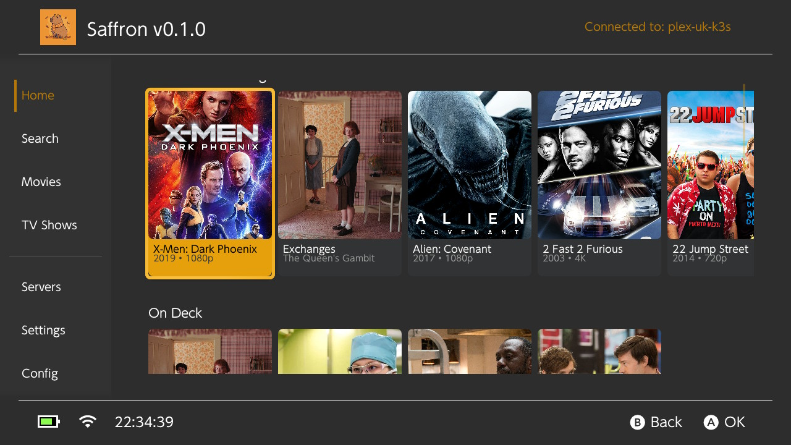
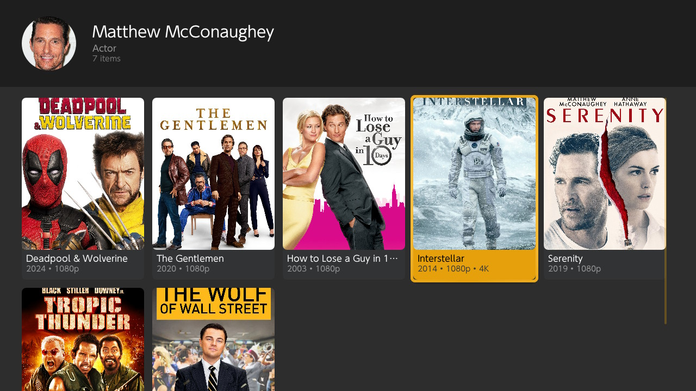
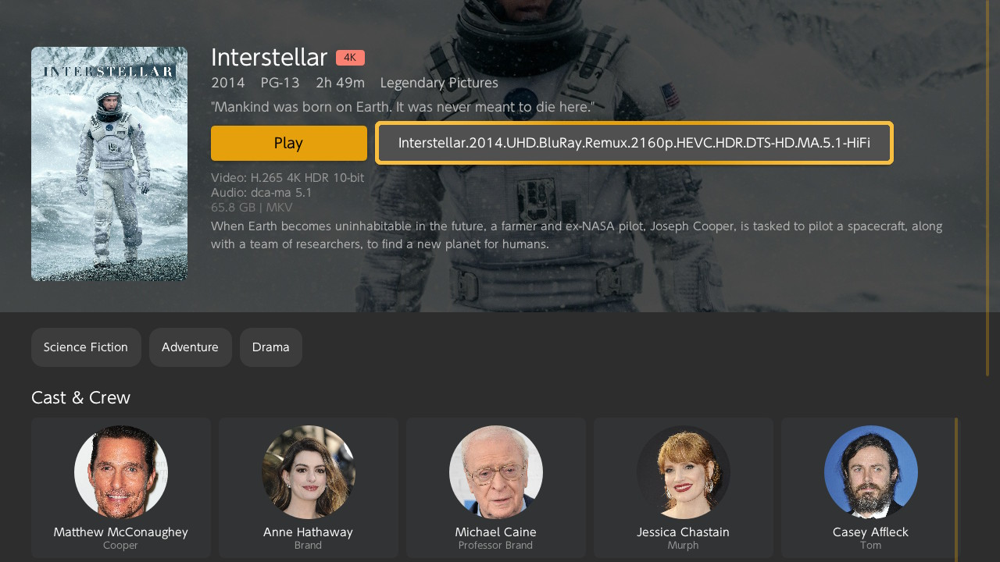
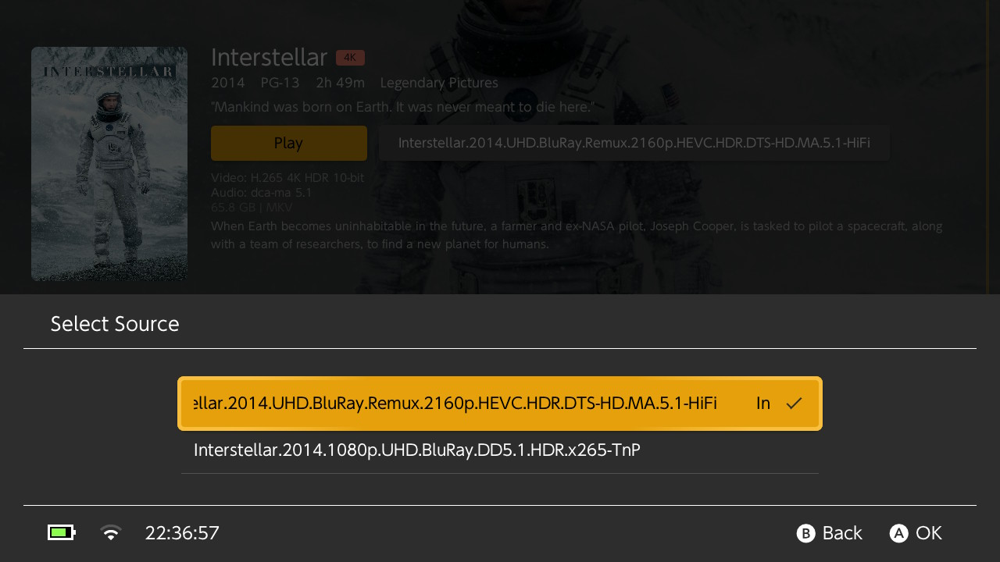
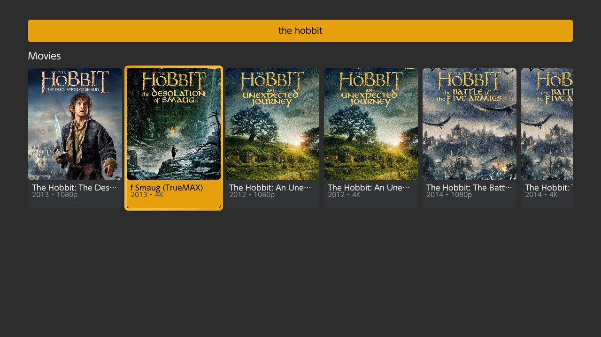
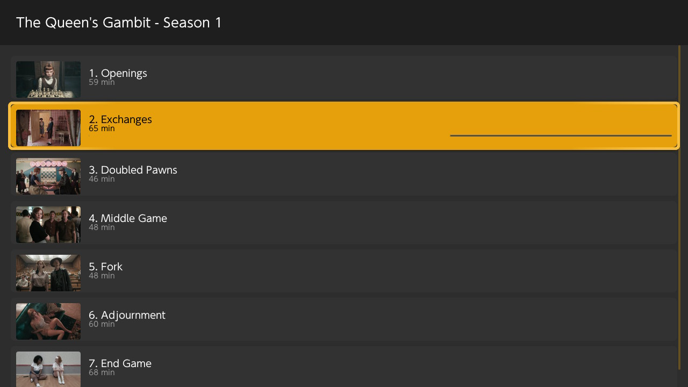
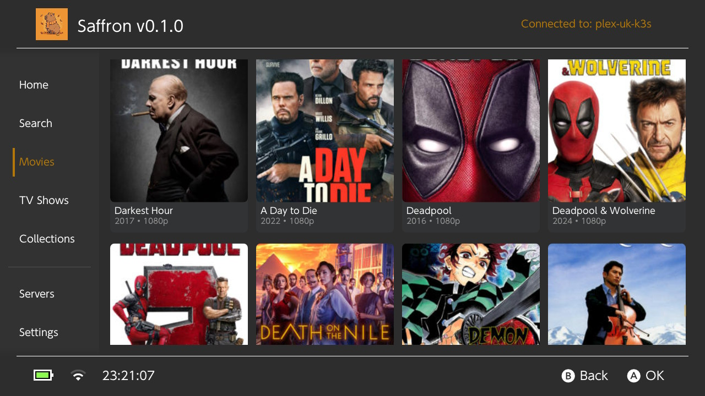
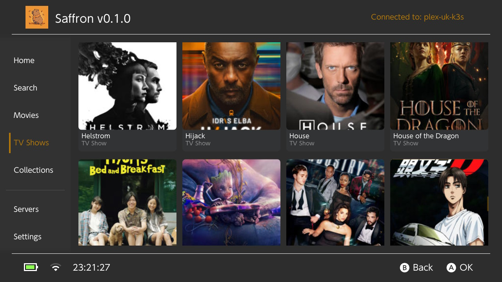
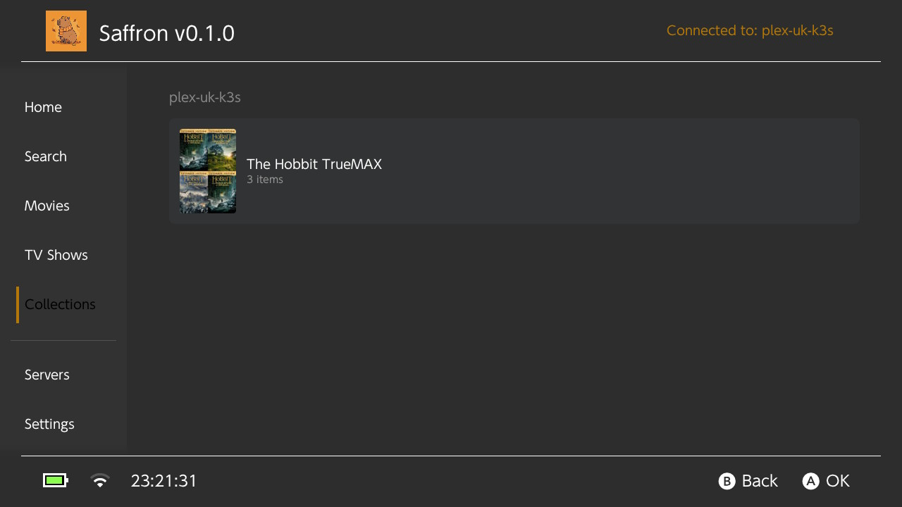
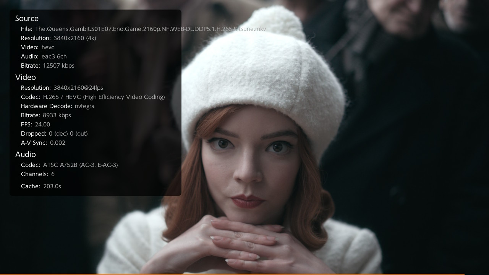

# Saffron

Saffron is a very rudimentary attempt at writing a Plex Client for the switch. When I say rudimentary, I mean that my main focus is playing a video. via direct play.

**Most of Saffron's code around the media playback comes from [switchfin](https://github.com/dragonflylee/switchfin). You can think of it as a fork that changed due to the plex API. Dragonflylee has figured out almost all of the hard problems short of the lack of documentation around how to actually use the plex api and build a usable client and I would like to thank him for it.**

Per license the code will be Licensed as GPL3, but dragonflylee, xfangfang, and anyone in switchfin's credits are excluded from this, as I relied very heavily on them to do this. Thank you.

# Blurb

**I wrote this because it would be nice for my partner to watch on her switch lite.**. I released it because nobody else has released a Plex client on the switch. **You can expect bugs**.

I dont intend to fully cover the entire thing, if you find a missing feature, please implement it and PR it. Don't hope for it to come. and don't send passive agressive messages.

This is also my first attempt at doing a media player client so please expect it to be very jank.

If you want a proper client I suggest you host jellyfin and use switchfin instead. Plex is just grandfathered in for me and I will probably move to jellyfin eventually.


# Screens

| | |
|:---:|:---:|
|  |  |
|  |  |
|  |  |
|  |  |
|  |  |
|  |  |
|  |  |

# Notes

## Playing 4k video.

Don't expect to play 4k smoothly without OCing. I have included the same overclock options that switchfin has **for my own usage**. **These options are hidden, and I reccomend that you don't use them.**

As it stands, my own test on a ~30k bitrate video (The Dark Knight) overclocks, takes a little buffering pauses at the start, and then continues playing smoothly as the cache goes up to 500mb. Of course, if you seek, everything goes out of the window and it starts over. Just dont play 4k on this and make your life easy. 

**I am not responsible for any damage to your switch. You are free to inspect the source code and responsible for the decision to run it on your own device.**

## Direct Play

I request a http stream for the direct play, not HLS. seeking should work pretty well if you're on direct play and under 4k.

## Transcoding.
When transcoding, I pretend that I'm a Chrome Browser. No matter what I did using nvidia shield quality profiles always got rejected for me, so I just pretend that I'm a chrome browser. Please submit a PR if you have any ideas about this. Im pretty sure Im doing something not quite right here, but I think that as we're using libmpv with ffmpeg, the profile doesnt quite matter - it can handle most of the scenarios we have, so we just always offer direct play. 

Seeking sucks when transcoding. If you can fix it, please open a PR. It basically needs to kill the stream and re-open it at the new offset (re-request a new transcode), and then it goes through all of these bits. You also cant do it quickly.

```
sed) AV: 00:00:00 / 00:29:24 (0%) A-V:  0.000 Cache: 232s/106MB
(Paused) AV: 00:00:00 / 00:29:24 (0%) A-V:  0.000 Cache: 234s/107MB11:20:18.753[INFO] PlexApi::reportTimeline - ratingKey=11756 time=606516 state=playing
11:20:18.886[DEBUG] Timeline reported successfully (HTTP 200)

[ffmpeg] https: Opening 'https://my.plex.server:443/video/:/transcode/universal/session/8b5e09d8-ff2a-458b-b419-559302ef0ac7/base/00170.ts' for reading
(Paused) AV: 00:00:00 / 00:29:24 (0%) A-V:  0.000 Cache: 234s/107MB
(Paused) AV: 00:00:00 / 00:29:24 (0%) A-V:  0.000 Cache: 239s/109MB
(Paused) AV: 00:00:00 / 00:29:24 (0%) A-V:  0.000 Cache: 243s/111MB
....
(Paused) AV: 00:00:00 / 00:29:24 (0%) A-V:  0.000 Cache: 276s/127MB
[ffmpeg] https: Opening 'https://my.plex.server:443/video/:/transcode/universal/session/8b5e09d8-ff2a-458b-b419-559302ef0ac7/base/00178.ts' for reading
(Paused) AV: 00:00:00 / 00:29:24 (0%) A-V:  0.000 Cache: 276s/127MB
(Paused) AV: 00:00:00 / 00:29:24 (0%) A-V:  0.000 Cache: 279s/128MB
(Paused) AV: 00:00:00 / 00:29:24 (0%) A-V:  0.000 Cache: 283s/129MB
...
```

Im pretty sure my mpv options are not optimized, if you have a better idea, please submit a PR.

I also didnt add websockets for live updates as I personally dont have the need to. 


## Testing

I haven't tested this against AV1, only h265/h264.

The UI supports the following

- Link via 4 digit code.
- Different editions (and I include the edition name as well)
- Different **sources** for the same video - you should get a pop up.
- Collections (last minute addition, might be jank)
- HLS stream via transcode.
- HTTP stream via original quality
- Search by title/tags (actors, director, writer, genre)
- Reporting might still be fucked
- **I completely ignore any decision that comes out of plex's decision API and offer a direct HTTP play for all options**. 

I only have one server to test and my testing ability is limited, but this worked for what I have.

# Credits

- [switchfin by dragonflylee, from which alot of code is taken:](github.com/dragonflylee/switchfin)

And from switchfin credits,
- @devkitpro and switchbrew for [libnx](https://github.com/switchbrew/libnx)
- @natinusala and XITRIX for [borealis](https://github.com/natinusala/borealis)
- @proconsule for [nxmp](https://github.com/proconsule/nxmp)
- @averne for great work of [FFmpeg](https://github.com/averne/FFmpeg) hwaccel backend
- @averne deko3d backend of [mpv](https://github.com/averne/mpv)

And lastly, for the icon:
- Capybara by [Vecteezy.com](https://www.vecteezy.com/vector-art/67372375-cute-capybara-in-autumn-with-scarf-and-leaves)


# Issues

Please open a PR.
